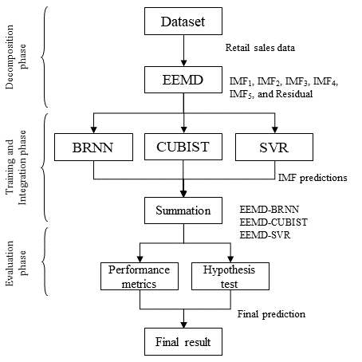

# Publication in [XV Brazilian Congress on Computational Intelligence (2021 CBIC)](https://www.cbic21.org/)

## :package::pill: Multi-Step Ahead Forecasting Applied to Rossmann Store Sales Case
[</img> Ramon Gomes da Silva][RamonID], [</img> Matheus H. D. M. Ribeiro][MatheusID], [</img> José H. K. Larcher][JoseID], [</img> Viviana Cocco Mariani][VivianaID], [</img> Leandro dos Santos Coelho][LeandroID]



### Publication
- [Conference paper (SBIC website)](https://sbic.org.br/eventos/cbic_2021/cbic2021-25/)

### How to cite this paper
```bibtex
@inproceedings{dasilva2021cbic,
  doi = {10.21528/CBIC2021-25},
  year = {2021},
  month = {oct},
  publisher = {{SBIC}},
  pages = {1--6},
  author = {Ramon Gomes {da Silva} and Matheus Henrique Dal Molin Ribeiro and Jos\'e Henrique Klein\"ubing Larcher and Viviana Cocco Mariani and Leandro Santos Coelho},
  title = {Artificial Intelligence and Signal Decomposition Approach Applied to Retail Sales Forecasting},
  booktitle = {Anais do 15 Congresso Brasileiro de Intelig\^encia Computacional},
  editor = {Carmelo Jos'e Albanez Bastos Filho and Hugo Valadares Siqueira and Danton Diego Ferreira and Douglas Wildgrube Bertol and Roberto C'elio Lim\~ao de Oliveira},
  address = {Joinville, SC}
}
```

[RamonID]: https://orcid.org/0000-0001-8580-7695
[MatheusID]: https://orcid.org/0000-0001-7387-9077
[JoseID]: https://orcid.org/0000-0001-8654-0312
[VivianaID]: https://orcid.org/0000-0003-2490-4568
[LeandroID]: https://orcid.org/0000-0001-5728-943X
