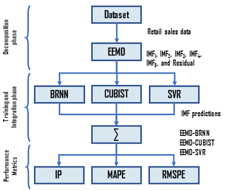

# Publication in [2021 International Joint Conference on Neural Networks (IJCNN)](https://www.ijcnn.org/)

## :package::pill: Retail sales multi-step ahead forecasting: a Rossmann Store Sales case
[</img> Ramon Gomes da Silva][RamonID], [</img> Matheus H. D. M. Ribeiro][MatheusID], [</img> Viviana Cocco Mariani][VivianaID], [</img> Leandro dos Santos Coelho][LeandroID]



### Publication
- [Preprint (ResearchGate)][RG]
- [Conference paper (IEEE *Xplore*)][IEEE]

### How to cite this paper
```bibtex
```

[RamonID]: https://orcid.org/0000-0001-8580-7695
[MatheusID]: https://orcid.org/0000-0001-7387-9077
[VivianaID]: https://orcid.org/0000-0003-2490-4568
[LeandroID]: https://orcid.org/0000-0001-5728-943X
[RG]: https://researchgate.net
[IEEE]: https://ieeexplore.ieee.org/Xplore/home.jsp